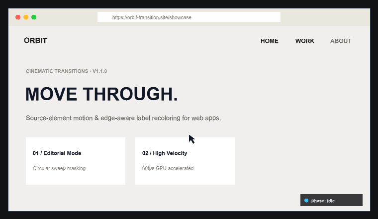

<div align="center">

# Orbit Transition

**Cinematic page transitions for the web, with source-element motion and edge-aware label recoloring.**

[](https://www.npmjs.com/package/orbit-transition)
[](https://opensource.org/licenses/MIT)
[](./src/index.d.ts)
[](./src/index.js)

<br/>



<br/>
<br/>

[**Live Demo Showcase**](https://mohammedouassimbentebba-collab.github.io/orbit-transition/) · [**NPM Package**](https://www.npmjs.com/package/orbit-transition) · [**GitHub Repository**](https://github.com/mohammedouassimbentebba-collab/orbit-transition)

</div>

---

## Overview

Orbit Transition turns the element that triggered navigation into part of the transition itself:
1. **Label Motion**: The clicked navigation label smoothly scales and glides towards the viewport center.
2. **Orbital Sweep**: A giant GPU-accelerated circular wipe sweeps across the screen.
3. **Edge-Aware Optics**: The label dynamically re-colors at the exact boundary where the circle crosses it.
4. **Seamless Reveal**: The destination page is revealed under full coverage, and the label docks gracefully into position.

## Features

- 🚀 **Framework-Neutral Core**: Pure JavaScript with zero runtime dependencies.
- ⚡ **60 FPS Hardware-Accelerated**: Fluid animations using CSS transforms, opacity, and clip-path layers.
- ⚛️ **Turn-Key Adapters**: Native bindings for **React**, **React Router**, and **Next.js App Router**.
- 🎨 **Preset System**: Built-in `cinematic`, `snappy`, and `soft` timing configurations.
- ♿ **Accessibility First**: Respects `prefers-reduced-motion` and manages `aria-busy` states automatically.
- 📘 **TypeScript Ready**: Full type definitions and intellisense included out of the box.

---

## Installation

```bash
npm install orbit-transition
```

Or with pnpm / yarn / bun:

```bash
pnpm add orbit-transition
# yarn add orbit-transition
# bun add orbit-transition
```

---

## Quick Start

### 1. Vanilla JavaScript

```js
import { createOrbitTransition, presets } from 'orbit-transition';

const transition = createOrbitTransition({
  ...presets.cinematic,
  color: '#000000',
  labelScale: 1.8,
});

// Bind all internal navigation links automatically
transition.bindLinks({
  onNavigate: async (url) => {
    // Render your new view or fetch the page
    await renderPage(url);
  },
});
```

### 2. React

```jsx
import {
  OrbitTransitionProvider,
  TransitionLink,
} from 'orbit-transition/react';

export default function App() {
  return (
    <OrbitTransitionProvider options={{ preset: 'cinematic', color: '#000000' }}>
      <nav>
        <TransitionLink to="/work">WORK</TransitionLink>
        <TransitionLink to="/about">ABOUT</TransitionLink>
      </nav>
    </OrbitTransitionProvider>
  );
}
```

### 3. Next.js (App Router)

```jsx
'use client';

import { NextTransitionLink } from 'orbit-transition/next';

export function Navigation() {
  return (
    <header>
      <NextTransitionLink href="/work">WORK</NextTransitionLink>
      <NextTransitionLink href="/studio">STUDIO</NextTransitionLink>
    </header>
  );
}
```

### 4. React Router

```jsx
import { RouterTransitionLink } from 'orbit-transition/react-router';

export function Header() {
  return (
    <RouterTransitionLink to="/projects">PROJECTS</RouterTransitionLink>
  );
}
```

---

## Presets & Configuration

```js
import { presets } from 'orbit-transition';

// Available out-of-the-box presets:
presets.cinematic // 1240ms - Epic, weighted easing with deep center hold
presets.snappy    // 920ms  - High velocity, energetic response
presets.soft      // 1420ms - Gentle deceleration with delicate feathering
```

### Options Reference

| Option | Type | Default | Description |
| :--- | :--- | :--- | :--- |
| `duration` | `number` | `1240` | Total animation duration in milliseconds |
| `color` | `string` | `'#000000'` | Background color of the orbital wipe circle |
| `labelColor` | `string` | `'#ffffff'` | Color of the label when enclosed in the wipe |
| `labelScale` | `number` | `1.8` | Maximum scaling factor for the moving label |
| `centerHold` | `number` | `0.02` | Pause duration at screen center |
| `sweepRatio` | `number` | `0.42` | Proportion of time dedicated to circle travel |
| `revealRatio` | `number` | `0.16` | Reveal phase ratio |
| `returnRatio` | `number` | `0.16` | Return dock phase ratio |
| `reducedMotion` | `boolean` | `undefined` | Override system reduced-motion preference |

---

## Lifecycle Events

Observe state changes throughout the animation lifecycle:

```js
const unsubscribe = transition.onPhase(({ name }) => {
  console.log('Current Phase:', name);
  // Emits: 'start' -> 'label-move' -> 'center' -> 'sweep' -> 'covered' -> 'reveal' -> 'return' -> 'idle'
});
```

---

## Local Development & Showcase

To run the interactive showcase and Motion Lab locally:

```bash
# Clone the repository
git clone https://github.com/mohammedouassimbentebba-collab/orbit-transition.git
cd orbit-transition

# Run the showcase dev server
npm run dev

# Run the test suite
npm test
```

---

## Author & License

Created and maintained by **Mohammed Ouassim Bentebba** ([@mohammedouassimbentebba-collab](https://github.com/mohammedouassimbentebba-collab)).

Licensed under the [MIT License](./LICENSE).
